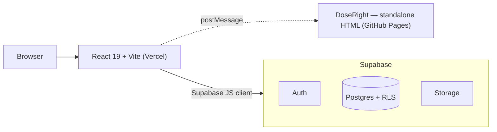

# SYSTEM_ARCHITECTURE.md

> Adopted 2026-07-03. Written specifically for MaTri Portal — replaces an earlier generic draft that assumed a custom backend API server, which does not match the approach agreed for this project.

## Purpose

Defines the logical architecture of the MaTri Portal: how the pieces described in `DOMAIN_MODEL.md` (Organization, Treatment, Pricing, Documentation, MatriSure Verification) actually get built and hosted.

---

## Architectural principle: no custom backend server

The single most important architectural decision for this project: **the React frontend talks directly to Supabase — there is no custom backend API layer to build or maintain.**

Supabase provides, out of the box:
- **Postgres database**, with Row Level Security (RLS) as the access-control layer
- **Auth** (email + password, matching the existing "no social login" business rule)
- **Storage** (for MatriSure verification photos and versioned documents)
- **Auto-generated REST/realtime APIs** over the schema, called directly from the React app

This means "who can see what" is enforced as *database policy*, not as application code we write and maintain ourselves. A traditional Node/Express-style API with hand-rolled JWT validation and RBAC middleware — the shape a generic SaaS architecture doc would suggest — is explicitly **not** part of this design. Less custom code to maintain, and the security boundary lives in one place instead of being re-implemented on every endpoint.

---

## High-level architecture

DoseRight (the scientific dose calculator, `1mcp-dose-calculator.html`) stays a separate standalone static page on GitHub Pages, opened in a popup and communicating back to the main app via `postMessage` — this already works today and does not change.

---

## Main components

### Frontend
- React 19 + Vite, deployed on Vercel (as today), auto-deploy from `main`.
- Talks to Supabase using the `supabase-js` client library — no intermediate API to call.
- Responsible for: rendering, form validation for UX (not security), calling Supabase directly for reads/writes.

### Database (Postgres via Supabase)
Tables map directly to `DOMAIN_MODEL.md` entities: `organizations`, `customer_details`, `treatments`, `cold_rooms`, `generators`, `pricing_tables`, `documents`, `matrisure_verifications`, `profiles` (links a Supabase Auth user to an `organizations` row + Business Role). Full column-level schema belongs in a future `DATABASE_MODEL.md`, written once the schema is actually built (kept as living documentation generated from the real schema, not written speculatively in advance).

### Access control (Row Level Security)
Implements the single rule from `DOMAIN_MODEL.md`: **a user can see and manage their own Organization and everything below it in the tree.** In practice: a Postgres function walks `organizations.parent_id` to check whether a target row's organization is a descendant of the current user's organization, and every table with an `org_id` column has an RLS policy built on that function. Business Roles (Owner/Approver/Planner/Operator/Viewer) are a second, finer-grained layer of policy *within* an organization — e.g. only Approver/Owner roles can update a Treatment's status to Approved.

> **Pricing is the one exception to "only see your own subtree" (fixed 2026-07-07, `0003_fix_pricing_visibility.sql`):** a Customer must be able to *read* the pricing its Distributor configured (an ancestor, not a descendant) to show indicative costs — the opposite direction from every other table. Pricing tables therefore have a broader SELECT policy (visible anywhere along your own lineage, up or down) while INSERT/UPDATE/DELETE stay restricted to your own managed subtree only, so a Customer can see but never edit its Distributor's prices.

### Auth
- Supabase Auth, email + password only.
- **Known gap to design for:** the business rule "password reset is admin-controlled only, no self-service" (existing `PROJECT_SPEC.md` decision) is *not* Supabase's default self-service flow. This needs either a Supabase Edge Function that uses the Admin API to generate and email a temporary password, or an admin-only screen that triggers the equivalent — to be designed when we build the Auth flow, not assumed away.

### Storage
- Supabase Storage bucket(s) for MatriSure verification photos and versioned documents (labels, SDS, manuals).
- RLS-equivalent policies on Storage objects, scoped the same way as the database (own organization + descendants).
- MatriSure photos must come from a live camera capture in the browser/app — enforced at the UI layer (no gallery picker offered), same as today.

### DoseRight
- Unchanged: standalone static HTML/JS, hosted on GitHub Pages, no Supabase dependency. Sends the chosen dose back to the Treatment Planner via `postMessage`.

---

## What this architecture explicitly does NOT include

- No custom backend API server (Node, Express, or otherwise)
- No message queue / background job infrastructure
- No microservices
- No third-party RBAC/JWT middleware — Supabase Auth + Postgres RLS is the entire access-control stack

These are deliberately out of scope, consistent with `PRODUCT_PHILOSOPHY.md`'s "IS NOT an ERP / not over-engineered for a single market" stance. If a genuine need for server-side business logic beyond what RLS + Postgres functions/triggers can express comes up later (e.g. sending emails on Treatment status change), the answer is a Supabase Edge Function — not a general-purpose backend service.

---

## Multi-country scalability

Because access control and pricing both derive from the `organizations` table (see `DOMAIN_MODEL.md` → Organizational Model), onboarding a new country (Colombia/Almagrícola, Brazil/ARUA, Chile/Fosfoquim, …) is a data operation — inserting new rows — not a schema change or a new deployment. The same Postgres project, the same RLS policies, and the same React app serve every country.
